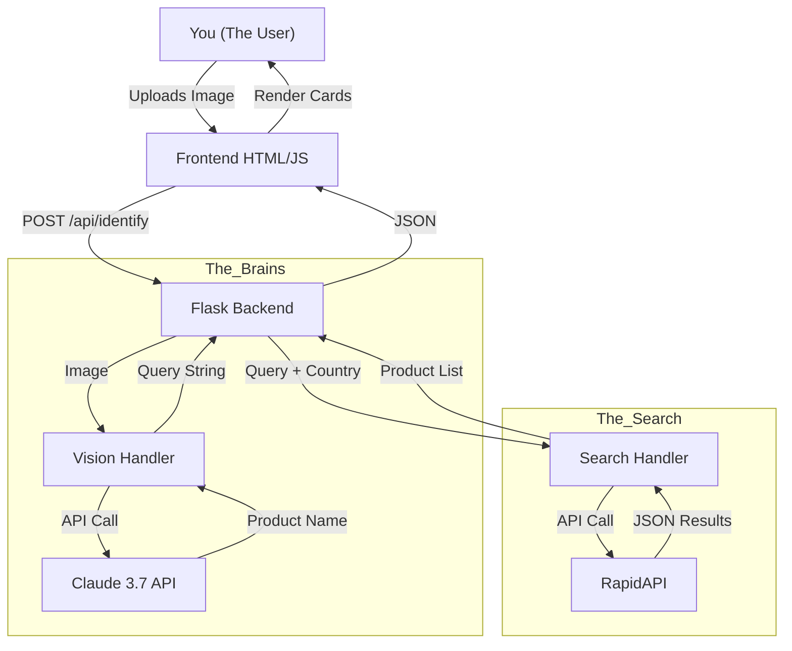

Hey there! Welcome to **dig**.

Honestly, I was just bored one weekend and thought, "Why can't I just snap a pic of something and find out where to buy it cheaper without scrolling through a million ads?" So... I built this. It's a super minimal, no-nonsense tool to find products using just your camera.

## What is it? 

**dig** is a mobile-first web app that lets you:
1.  **Capture** a photo of anything (or upload one).
2.  **Identify** it using some fancy AI (Claude 3.7 Vision).
3.  **Search** for the best prices online (via RapidAPI).
4.  **Buy** it.

It's clean, it's fast, and it doesn't track you. I literally removed the persistent storage because I didn't want to clutter my hard drive. 
## How does it look?
### Choose

### Capture

### Search


## Features 

*   **Mobile First**: Designed to look good on your phone.
*   **Smart Vision**: Uses Claude 3.7 Sonnet to figure out exactly what you're looking at (Brand, Model, Size).
*   **Location Aware**: Automatically detects your region so you don't get results in USD if you're in India (and vice versa).
*   **Privacy Focused**: No database. No tracking. Your uploaded image is deleted the second the search is done.
*   **Dark/Light Mode**: Just kidding, it's strictly Black & White because it looks elegant. ⚫⚪

## How to Run It 

Want to run this locally? Cool. Here's how:

### Prerequisites
*   Python 3.x
*   An API Key for **Anthropic** (Claude)
*   An API Key for **RapidAPI** (Real-Time Product Search)

### Steps
1.  Clone this repo (or just download the files).
2.  Install the dependencies:
    ```bash
    pip install -r requirements.txt
    ```
3.  Set up your `.env` file:
    ```env
    ANTHROPIC_API_KEY=your_key_here
    RAPIDAPI_KEY=your_key_here
    RAPIDAPI_HOST=real-time-product-search.p.rapidapi.com
    ```
4.  Run the app:
    ```bash
    python app.py
    ```
5.  Open `http://localhost:5000` and start digging!

## The "Smart" Stuff (Architecture) 



**How it works:**

1.  **You** upload a pic.
2.  **Flask** grabs it and sends it to **Claude**.
3.  **Claude** tells us what it is (e.g., "Red Bull 250ml").
4.  We send that text to **RapidAPI** to find prices in your country.
5.  We show you the results. Done.

## Tech Stack

*   **Backend**: Flask (Python)
*   **AI Vision**: Claude 3.7 Sonnet (Anthropic API)
*   **Product Search**: RapidAPI Real-Time Product Search
*   **Frontend**: Vanilla HTML/CSS/JS (no frameworks, we keep it real)
*   **Styling**: Custom CSS with a brutalist black & white aesthetic

## Project Structure

```
dig/
├── app.py                 # Main Flask application
├── main.py                # Application entry point
├── vision_handler.py      # Claude Vision API integration
├── search_handler.py      # RapidAPI product search logic
├── requirements.txt       # Python dependencies
├── .env                   # API keys (create this yourself)
├── .gitignore            # Git ignore file
├── README.md             # You are here
├── visits.txt            # Visit counter (auto-generated)
├── static/
│   ├── logo.svg          # App logo
│   ├── style.css         # All the pretty styles
│   └── script.js         # Frontend JavaScript
├── templates/
│   └── index.html        # The single page app
└── uploads/              # Temporary image storage (auto-cleaned)
```

## API Endpoints

### `POST /api/identify`
Upload an image to identify the product and search for prices.

**Request:**
- `Content-Type: multipart/form-data`
- `image`: Image file
- `country`: Country code (optional, defaults to user's location)

**Response:**
```json
{
  "product_name": "Red Bull Energy Drink 250ml",
  "results": [
    {
      "title": "Red Bull Energy Drink",
      "price": "$2.99",
      "link": "https://...",
      "source": "Amazon"
    }
  ]
}
```

## Contributing 

Found a bug? Want to add a "Dark Mode" (please don't)? Feel free to open a PR. I might look at it when I'm bored again.